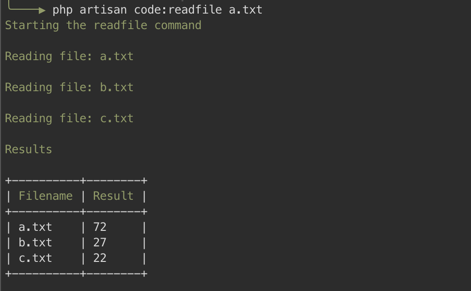

# Files Exercise



This a little Laravel app, given a file, will calculate the sum of all the integers and will do it recursively
on any other file pointed.

## Installation:

To install the app make sure to have `PHP 7.4` and `composer` installed on your machine, and follow these steps:
- Clone this repo, `git clone https://github.com/jeop10/files-exercise.git`
- Run `composer install`

After that you should be able to execute the following task

```
php artisan code:readfile a.txt
```

Where the `a.txt` is the first valid file for the app to search on. **Only .txt files are supported**
and the files **must be placed on the root of the directory**

After the app have finish running you will see in the console an output with the sum of the integers found and as well 
as the results of the other files found.

---

## Example:

Let's say that we have 3 files: `a.txt`, `b.txt`, `c.txt` and their contents are:

```
file: a.txt

3
19
b.txt
50
```

```
file: b.txt

c.txt
27
```

```
file: c.txt

10
12
```

The result of the app will be:

```
+----------+--------+
| Filename | Result |
+----------+--------+
| a.txt    | 72     |
| b.txt    | 27     |
| c.txt    | 22     |
+----------+--------+
```

---

## Internals.

This app works as an `artisan command`, so all the logics reside inside the `app/Console/Commands/ReadFile.php` 
due to the fact of its small business logic.

By using Laravel I took advantage of all the components that this framework provides.

Also, for debugging purposes an `-v` option is accepted on this command.

---

## Considerations and Improvements 

To improve this app, here is a list a possible recommendations:
- Support files that are in any location, not only on the root directory.
- Store the results of the `artisan command` into a `results.txt` file to give the user another way of saving the output.
- Support multiple extensions, not just .txt
